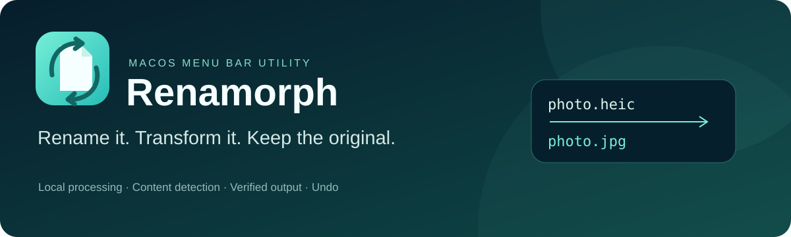

<div align="center">



[Русский](README.md) · [English](README.en.md) · **Español**

**Cambia la extensión. Convierte el archivo. Conserva el original.**

[](https://github.com/Mizzzord/Renamorph/stargazers)
[](https://github.com/Mizzzord/Renamorph/releases)
[](https://github.com/Mizzzord/Renamorph/releases)
[](LICENSE)

[**Descargar para macOS ↗**](https://github.com/Mizzzord/Renamorph/releases) · [Formatos](docs/FORMATS.md) · [Validación](docs/VALIDATION.md)

</div>

---

## Un cambio de nombre que convierte el contenido

Renamorph es una utilidad de la barra de menús de macOS para convertir archivos localmente. Su nombre combina *rename* y *morph*: renombrar y transformar.

Cambiar `photo.heic` por `photo.jpg` normalmente deja datos HEIC dentro. Renamorph detecta el cambio en una carpeta elegida, reconoce el contenido real y crea un JPEG auténtico. Antes de publicar el resultado, guarda el original y valida la salida.

```text
photo.heic → photo.jpg     HEIC → JPEG real
song.flac  → song.mp3      FLAC → MP3
clip.mov   → clip.mp4      remultiplexación o recodificación según los ajustes
```

## Funciones

| Función | Comportamiento |
| --- | --- |
| Observación | Carpetas elegidas, exclusiones, agrupación de eventos y reconciliación segura tras reiniciar |
| Detección | Firmas, estructuras de contenedores, decodificación completa y análisis |
| Control | Confirmación o modo automático, reglas por pareja de formatos, cola, diagnóstico y cancelación |
| Conservación | Fuente estable, copia del original, control de versión, diario de publicación y recuperación |
| Deshacer | Restaura los bytes guardados; se detiene si el resultado fue modificado o sustituido |
| Privacidad | Conversión en tu Mac; no se suben archivos a servicios |

Una extensión compatible o un cambio de nombre sin cambiar la extensión no recodifica el archivo. Procesar archivos nuevos con una extensión incorrecta requiere una opción independiente, desactivada por defecto. La cuota de copias no borra automáticamente los originales antiguos.

## 29 formatos · 264 rutas

| Familia | Entrada | Salida |
| --- | --- | --- |
| Imágenes | JPEG, PNG, TIFF, HEIC, BMP, WebP, GIF, AVIF | JPEG, PNG, TIFF, HEIC, BMP, WebP, AVIF |
| Audio | MP3, WAV, FLAC, AIFF, M4A, AAC, Ogg, Opus, WMA, CAF, WavPack | Todos los anteriores excepto WMA; AAC o ALAC para M4A |
| Vídeo | MP4, MOV, MKV, WebM, AVI, MPEG, WMV, TS | MP4, MOV, MKV, WebM, AVI; extracción de audio |
| Subtítulos | SRT, WebVTT | SRT ↔ WebVTT |

Las rutas tienen restricciones de códecs, pistas y propiedades. Las imágenes son estáticas; GIF solo admite una imagen de entrada. WMV → AVI está desactivado. La remultiplexación conserva las pistas comprimidas, pero elimina etiquetas y capítulos; la recodificación puede reducir la calidad. [Matriz completa y pérdidas](docs/FORMATS.md) (en ruso).

`file.png,webp` prepara resultados independientes a partir del mismo original. La política de grupo debe elegirse explícitamente. Los archivos se publican uno por uno con un diario de recuperación.

## Instalación

**Binario actual: macOS 27.0+, Apple Silicon, APFS local.** Esta es la configuración comprobada. No se declara compatibilidad con Intel ni con versiones anteriores de macOS.

1. Descarga `Renamorph-0.4.1-macOS-arm64.zip` desde [Releases](https://github.com/Mizzzord/Renamorph/releases). Los archivos incluyen `SHA256SUMS`.
2. Descomprime, mueve `Renamorph.app` a Aplicaciones y ábrela.
3. Añade una carpeta y empieza con una copia de prueba en modo de confirmación.
4. Cambia la extensión, revisa los parámetros y aprueba. Historial / Deshacer permite recuperar el original.

La compilación tiene firma **ad-hoc y no está notarizada**. macOS puede bloquear el primer inicio; si confías en el archivo verificado, utiliza Abrir igualmente en Ajustes del Sistema → Privacidad y seguridad. [Instrucciones de Apple](https://support.apple.com/en-us/102445). No hace falta Homebrew para ejecutar la aplicación. La interfaz actual está en ruso; estas traducciones del README no implican una interfaz localizada.

Los perfiles existentes de ConsulMAC conservan ajustes, historial y copias en su directorio anterior. Las instalaciones nuevas usan `~/Library/Application Support/Renamorph`.

## Menor tamaño y mejoras medidas

El paquete ocupa unos **31 MiB**, frente a 94 MiB en una versión anterior, conservando y ampliando las rutas. Se eliminaron dependencias innecesarias de FFmpeg y símbolos de depuración. La validación completa procesa los fotogramas en una única pasada.

Con archivos sintéticos: WAV → MP3 con validación **2,8×**, MOV → MKV **6,4×** y recodificación H.264 **3,4×** más rápidos que antes. Son medianas de tres ejecuciones locales; no incluyen confirmación, copias ni publicación. [Método y mediciones](docs/VALIDATION-0.3.md) (en ruso).

## Compilar y probar

Se necesitan Apple Command Line Tools con Swift 6 / Swift Testing, Python 3 y Homebrew. Comprobado con Swift 6.4 / SDK 27.0.

```bash
git clone https://github.com/Mizzzord/Renamorph.git
cd Renamorph
brew install pkgconf x264 lame opus libvorbis libvpx webp dav1d
bash scripts/build-app.sh
open dist/Renamorph.app
bash scripts/test.sh
```

La primera compilación construye FFmpeg 9.0.2 desde un archivo con SHA-256 fijado. La versión mínima de macOS se calcula a partir de todas las bibliotecas incluidas; otro equipo puede producir otro mínimo. El objetivo macOS 14 del paquete Swift no demuestra compatibilidad del paquete multimedia completo.

Las pruebas usan copias preparadas y motores reales: rutas declaradas, confirmaciones obsoletas, conflictos, cancelación, archivos dañados, Deshacer y recuperación tras fallos. [Informe](docs/VALIDATION.md) (en ruso).

## Límites actuales

Se admiten archivos locales en APFS. Se rechazan enlaces simbólicos, enlaces duros, archivos de nube sin descargar y volúmenes externos o de red. No se promete restauración completa de ACL, xattrs o etiquetas del Finder. No se han probado cortes físicos de energía, ENOSPC real de todo el disco ni todos los perfiles VFR/HDR/multicanal. Los escaneos completos de árboles muy grandes siguen siendo costosos.

PDF/Office, archivos comprimidos, JPEG XL y más códecs de audio son candidatos, no rutas actuales. No se incluyen licencias comerciales, prueba temporal ni actualizador automático. [Origen](docs/ORIGINS.md) · [Contribuir](CONTRIBUTING.md).

## Licencia

**GPL-2.0-or-later.** © 2026 [Mizzzord](https://github.com/Mizzzord). Sin garantía.

El paquete utiliza FFmpeg y x264 bajo GPL-2.0-or-later; las demás bibliotecas conservan sus licencias. Cada versión binaria incluye un archivo separado con el código fuente correspondiente y las recetas de compilación. [Avisos y fuentes](docs/THIRD_PARTY.md).

<div align="center">

Si Renamorph te ayuda, una ⭐ permite que otros lo descubran.

</div>
