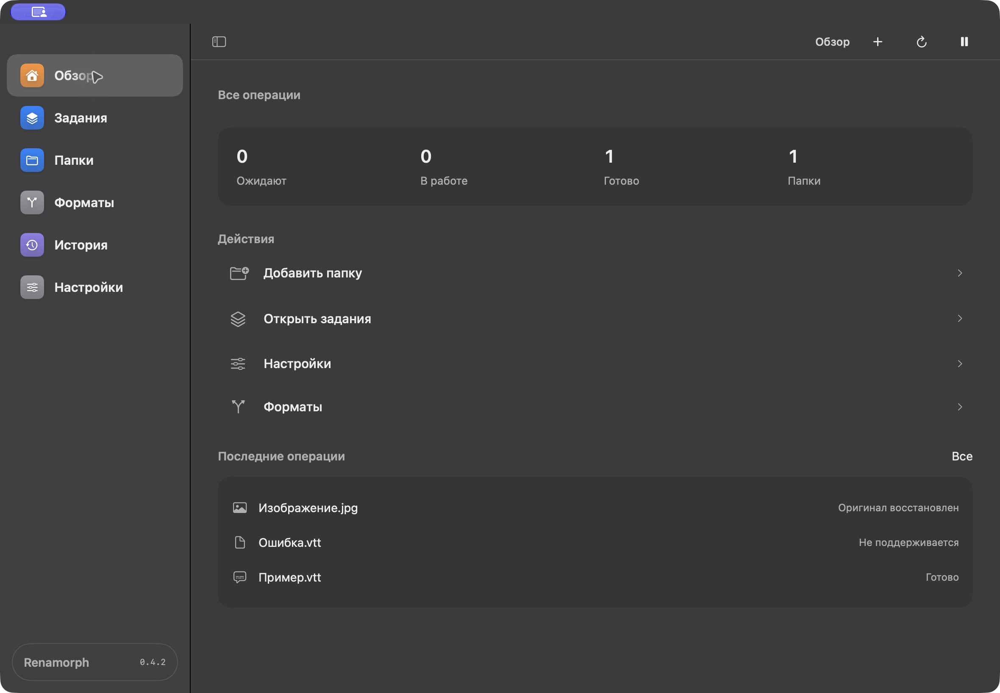

<div align="center">


**Русский** · [English](README.en.md) · [Español](README.es.md)

**Измени расширение. Получи новый формат. Сохрани оригинал.**

[](https://github.com/Mizzzord/Renamorph/stargazers)
[](https://github.com/Mizzzord/Renamorph/releases)
[](https://github.com/Mizzzord/Renamorph/releases)
[](LICENSE)

[**Скачать для macOS ↗**](https://github.com/Mizzzord/Renamorph/releases/tag/v0.4.2) · [Руководство](#руководство-по-использованию) · [Форматы](docs/FORMATS.md) · [Как собрать](#сборка-из-исходников)

</div>

---

## Переименование, которое действительно преобразует файл

Renamorph — утилита строки меню macOS для локальной конвертации файлов. Название соединяет *rename* и *morph*: переименовать и преобразовать.

Обычное переименование `photo.heic` в `photo.jpg` оставляет внутри HEIC. Renamorph замечает изменение в выбранной папке, определяет содержимое и создаёт настоящий JPEG. Перед публикацией он сохраняет оригинал и проверяет результат.

```text
photo.heic → photo.jpg     HEIC → настоящий JPEG
song.flac  → song.mp3      FLAC → MP3
clip.mov   → clip.mp4      перепаковка или перекодирование по настройкам
```

## Что внутри

| Возможность | Поведение |
| --- | --- |
| Наблюдение | Выбранные папки, исключения, объединение событий, безопасная сверка после перезапуска |
| Распознавание | Сигнатуры, структуры контейнеров, полное декодирование и разбор |
| Управление | Подтверждение или автоматический режим, правила пар, очередь, диагностика и отмена |
| Сохранность | Стабильный источник, резерв, проверка версии, журнал публикации и восстановление |
| Undo | Восстанавливает сохранённые байты; конфликт с ручными изменениями останавливает восстановление |
| Приватность | Конвертация на вашем Mac; файлы не отправляются сервисам |

Совместимое расширение или изменение основной части имени не перекодирует файл. Новый файл с неправильным расширением — отдельная выключенная по умолчанию настройка. Лимит резервов не запускает автоматическое удаление старых оригиналов.

## 29 форматов · 264 направления

| Семейство | Читаем | Создаём |
| --- | --- | --- |
| Изображения | JPEG, PNG, TIFF, HEIC, BMP, WebP, GIF, AVIF | JPEG, PNG, TIFF, HEIC, BMP, WebP, AVIF |
| Аудио | MP3, WAV, FLAC, AIFF, M4A, AAC, Ogg, Opus, WMA, CAF, WavPack | Все перечисленные, кроме WMA; M4A с AAC или ALAC |
| Видео | MP4, MOV, MKV, WebM, AVI, MPEG, WMV, TS | MP4, MOV, MKV, WebM, AVI; извлечение аудио |
| Субтитры | SRT, WebVTT | SRT ↔ WebVTT |

Направления имеют ограничения по кодекам, потокам и свойствам. Изображения пока статические; GIF используется как вход одного кадра. WMV → AVI отключено. Перепаковка сохраняет сжатые потоки, но не переносит теги и главы; перекодирование может снижать качество. [Полная матрица, параметры и потери →](docs/FORMATS.md)

Синтаксис `file.png,webp` готовит независимые результаты из одного оригинала. Политику группы нужно явно выбрать в настройках. Публикация нескольких файлов выполняется последовательно с журналом восстановления.

## Установка

**Текущий бинарный выпуск: macOS 27.0+, Apple Silicon, локальный APFS.** На этой конфигурации выполнены проверки. Intel и более ранние macOS не заявлены.

1. Скачайте [ZIP](https://github.com/Mizzzord/Renamorph/releases/download/v0.4.2/Renamorph-0.4.2-macOS-arm64.zip) или [DMG](https://github.com/Mizzzord/Renamorph/releases/download/v0.4.2/Renamorph-0.4.2-macOS-arm64.dmg) из [выпуска 0.4.2](https://github.com/Mizzzord/Renamorph/releases/tag/v0.4.2).
2. Распакуйте ZIP и перенесите `Renamorph.app` в «Программы». Для DMG откройте образ и перетащите приложение в `Applications`.
3. Откройте приложение. Для проверки загрузки рядом с архивами опубликован [SHA256SUMS](https://github.com/Mizzzord/Renamorph/releases/download/v0.4.2/SHA256SUMS).

Выпуск подписан ad-hoc и **не нотарифицирован**. macOS может остановить первый запуск: если вы доверяете проверенному файлу, используйте стандартный пункт разрешения открытия в «Системные настройки → Конфиденциальность и безопасность». [Инструкция Apple](https://support.apple.com/en-us/102445). Homebrew для запуска не нужен.

Для старого профиля ConsulMAC автоматически сохраняется прежнее расположение настроек, истории и резервов. Новые установки используют `~/Library/Application Support/Renamorph`. [Подробное руководство](docs/USER_GUIDE.ru.md).

## Руководство по использованию

### Первое преобразование

1. В «Обзоре» нажмите **«Добавить папку»** и выберите папку с файлами на внутреннем APFS-диске. Для первого запуска используйте копию файла.
2. Оставьте в «Настройки → Преобразование» режим **«Подтверждать»**.
3. В Finder измените расширение, например `photo.png` на `photo.jpg`. Если Finder спрашивает о смене расширения, подтвердите её.
4. Откройте **«Задания»**. В карточке должны появиться имя файла и направление `PNG → JPEG`. В «Подробностях» доступны путь, параметры и SHA-256 версии входа.
5. Нажмите **«Преобразовать»**. Дождитесь статуса **«Готово»** в истории: по выбранному имени появится файл в новом формате, а оригинал сохранится в резерве.

Существующие файлы не преобразуются при добавлении папки или запуске приложения. Обработка начинается после изменения расширения в наблюдаемой папке. Простое изменение имени без смены формата не запускает конвертацию.



### Разделы приложения

| Раздел | Для чего использовать |
| --- | --- |
| Обзор | Счётчики, быстрые действия и последние операции |
| Задания | Подтвердить, отклонить или отменить обработку; найти задание |
| Папки | Добавить папку, прекратить наблюдение или настроить исключения |
| Форматы | Найти доступные направления преобразования |
| История | Проверить результат, ошибку и доступность оригинала |
| Настройки | Выбрать режим, параметры, правила форматов и лимит резервов |

### Правила и качество

- В «Настройки → Преобразование» задайте общий режим: **«Подтверждать»**, **«Автоматически»** или **«Запретить»**.
- В «Настройки → Правила форматов» нажмите **«Добавить правило»**. Выберите исходный и новый форматы, режим и параметры, затем сохраните. Например, для `HEIC → JPEG` можно задать качество 85% и подтверждение.
- Правило конкретной пары имеет приоритет над общим режимом. Параметры правила применяются к этой паре; повтор той же пары добавить нельзя.
- Исключите папки, которые не нужно обрабатывать, в разделе «Папки». Обработка новых файлов с неверным расширением включается отдельно.

### Как вернуть оригинал

Откройте **«Историю»**, найдите операцию и нажмите **«Восстановить оригинал»**. Приложение возвращает байты из резерва. Если результат был изменён вручную или прежнее имя занято, восстановление остановится с конфликтом.

Кнопка **«Сохранить оригинал рядом»** создаёт отдельную копию с уникальным именем. Она полезна, если нужно оставить и результат, и оригинал. Лимит резервов меняется в «Настройки → Резервы и ресурсы»; старые оригиналы автоматически не удаляются.

### Несколько результатов

Переименуйте файл, например `photo.heic` в `photo.jpg,webp`. Подтвердите задание и дождитесь подготовки веток. Если политика группы ещё не выбрана, нажмите **«Выбрать политику группы»**, задайте её в настройках, вернитесь к заданию и нажмите **«Опубликовать группу»**. До публикации отдельную ветку можно отменить в «Подробностях».

### Управление и частые вопросы

| Действие или ситуация | Что сделать |
| --- | --- |
| Приостановить обработку новых событий | Нажать паузу в верхней панели; той же кнопкой возобновить наблюдение |
| Сверить содержимое папок | Нажать круговую стрелку в верхней панели; сверка не запускает преобразований |
| Скрыть или показать боковую панель | Кнопка боковой панели или `⌃⌘S` |
| Добавить папку с клавиатуры | `⇧⌘O` на экране «Обзор» или «Папки» |
| Закрыть или подтвердить редактор правила | `Esc` — отмена; `Return` — добавление допустимого правила |
| Задание не появилось | Проверить выбранную папку, исключения и паузу; убедиться, что изменилось расширение |
| «Не поддерживается» или ошибка | Проверить направление в «Форматах» и сообщение операции в «Истории» |
| Закончился лимит резервов | Увеличить лимит в настройках хранения; операция остановится до публикации |
| Закрылось окно | Открыть его через значок Renamorph в строке меню; закрытие окна не завершает приложение |

Чтобы обновить приложение, завершите Renamorph через меню в строке меню и замените `.app` новой версией в «Программах». Настройки, история и резервы находятся отдельно от приложения и сохраняются.

Интерфейс версии 0.4.2 написан на SwiftUI: серые поверхности, цветные иконки и короткие подписи. [Проверка интерфейса и снимки](docs/UI-MINIMAL-VALIDATION.md) · [Проверка выпуска 0.4.2](docs/RELEASE-0.4.2.md).

## Компактнее и быстрее

Пакет занимает около **31 MiB** вместо 94 MiB в ранней сборке; текущая матрица сохранена и расширена. Убраны неиспользуемые зависимости FFmpeg и debug-символы. Полная проверка медиа выполняется одним проходом с потоковой обработкой кадров.

На контрольных файлах: WAV → MP3 с проверкой — **2,8×**, MOV → MKV — **6,4×**, H.264 перекодирование — **3,4×** быстрее ранней сборки. Это медианы трёх локальных запусков, без времени подтверждения, резервирования и публикации. [Методика, исходные данные и ограничения](docs/VALIDATION-0.3.md).

## Сборка из исходников

Нужны Apple Command Line Tools со Swift 6 / Swift Testing, Python 3 и Homebrew. Проверено со Swift 6.4 и SDK 27.0.

```bash
git clone https://github.com/Mizzzord/Renamorph.git
cd Renamorph
brew install pkgconf x264 lame opus libvorbis libvpx webp dav1d
bash scripts/build-app.sh
open dist/Renamorph.app
```

При первом запуске скрипт собирает FFmpeg 9.0.2 из архива с закреплённым SHA-256. Минимальная macOS вычисляется по всем включённым библиотекам: сборка на другой системе может дать другой минимум. Swift-пакет объявляет macOS 14, что само по себе не означает совместимость готового медиапакета с macOS 14.

```bash
bash scripts/test.sh
```

Проверки используют подготовленные копии: настоящие движки, все маршруты, устаревшее подтверждение, конфликты, отмену, повреждение, Undo и аварийное восстановление. [Отчёт →](docs/VALIDATION.md)

## Границы текущего выпуска

Поддержаны локальные APFS-файлы. Symlinks, hard links, облачные placeholders, внешние и сетевые тома отклоняются. Нет обещания полного переноса ACL, xattrs или Finder tags. Не проверены аппаратное отключение питания, реальный ENOSPC всего диска и все VFR/HDR/многоканальные профили. Полный рескан больших деревьев остаётся затратным.

PDF/Office, архивы, JPEG XL и дополнительные аудиокодеки рассмотрены как кандидаты; они не входят в заявленную матрицу. Лицензирование приложения, trial и автоматические обновления отсутствуют. [Разработка](docs/IMPLEMENTATION.md) · [Происхождение](docs/ORIGINS.md) · [Участие](CONTRIBUTING.md).

## Открытый код и лицензии

**GPL-2.0-or-later.** © 2026 [Mizzzord](https://github.com/Mizzzord). Приложение предоставляется без гарантий.

Выпуск использует FFmpeg и x264 под GPL-2.0-or-later; другие библиотеки сохраняют свои лицензии. Рядом с бинарной сборкой опубликован архив соответствующих исходников и рецептов сборки. [Лицензии и исходники движка](docs/THIRD_PARTY.md).

<div align="center">

Если Renamorph оказался полезен, ⭐ поможет другим найти проект.

</div>
